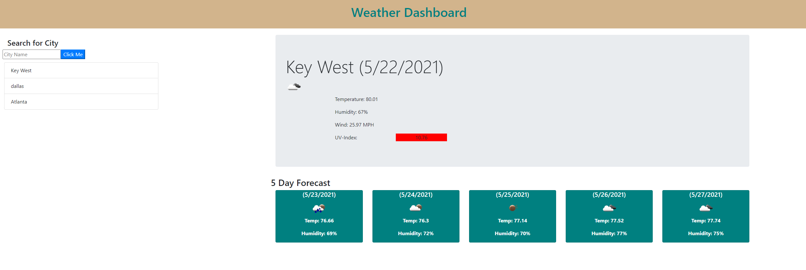

# Brian Morgan
##  Weather Dashboard HW 6

This webpage serves as a weather dashboard. When a user searches a city in the search bar, today's weather will appear in a large container on the screen, with a five-day forecast at the bottom of the screen. The user's searched cities are saved as list below the search bar, for easy access. If the user comes back to the page, their last search city will display upon opening the page.

	
    
[GitHub](https://github.com/N-Person/weatherdashboard)
[GitHubIO](https://n-person.github.io/weatherdashboard/)